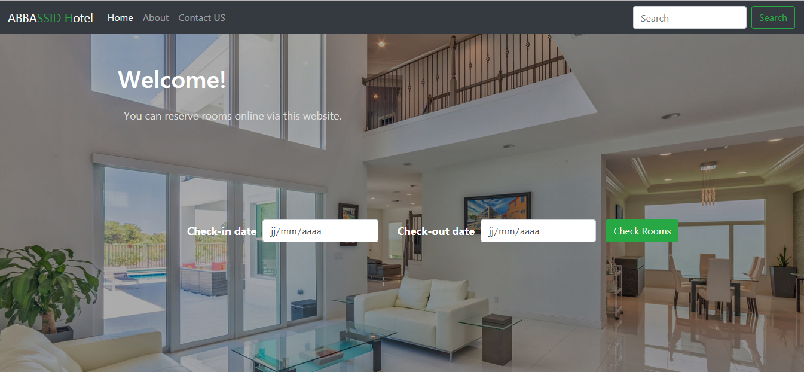
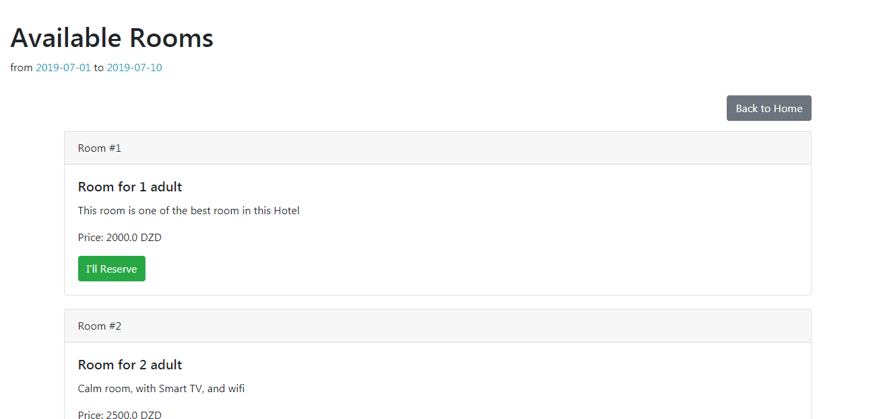
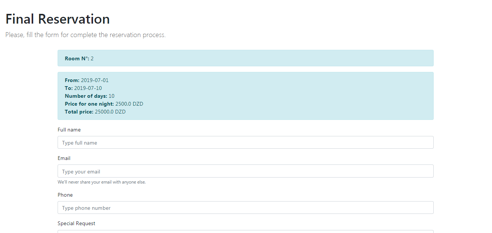

# Hotel Reservation System
A web application to book a room in a hotel, a customer must check the application to see if there is an empty room, the duration of the reservation and the overall cost ..etc. by introducing personal information.

 

### Report
* [Architecture and Software Development - PDF Version](Report.pdf)

### Screenshoot
Home           |
:--------------:|
 |

Available rooms    |
:-----------------:|
 |

Reservation       |
:----------------:|
 |

### Used Languages
* Java
* HTML
* CSS
* JavaScript

### Used Technologies & Frameworks
* JavaEE (JSP, Servlet, EJB)
* Bootstrap

### Used Database
* MySQL

### Used server
* GlassFish 5.0
 

 
